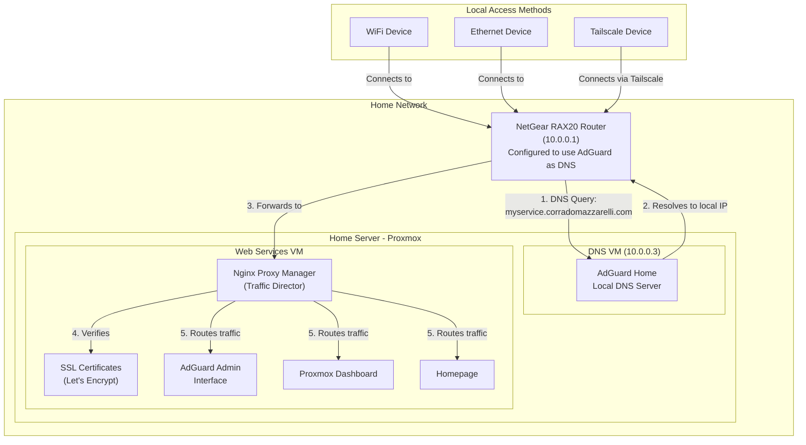
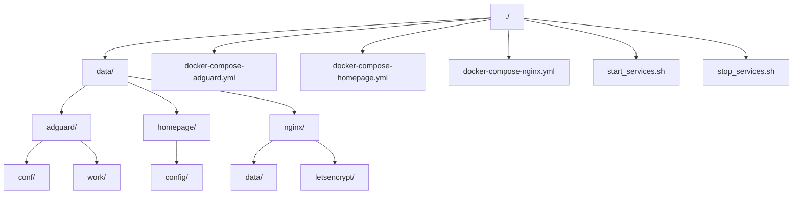

{: .box-success}
This article explores my journey learning networking while creating my homelab and setting up my home network. I currently have AdGuardHome as a local DNS server and ad blocker, Nginx Proxy Manager as my reverse proxy, and Homepage as my dashboard.

* Do not remove this line (it will not be displayed)
{:toc}

# Home Server Journey

I decided to setup a home server to learn about networking, as well as to enable future endeavors such as testing out a Docker Swarm autograder application for the next iteration of GE's Python Bootcamp that I created. This blog post goes through and explains two interesting mini-stories where I learned some fundamental concepts about networking or how operating systems work, and then finally goes over the steps I took to get to my current setup for the homelab. The ministories are in the order I discovered them, since my journey was highly non-linear and took me on a long route of learning. 

## Hardware

HP Elitedesk G2 with an Intel I5 Processor, 8 GB RAM, 256 GB SSD

## What is Proxmox?

Before diving into my home server journey, let me explain what Proxmox is and why I chose it. Imagine you have a powerful computer, but you want to run multiple independent computers on it - each with its own operating system, resources, and purpose. That's where Proxmox comes in.

Proxmox is what's called a "Type 1 Hypervisor" - software that runs directly on your computer's hardware and lets you create and manage multiple virtual machines (VMs) and containers. Think of it like having an apartment building manager who lives in the building and directly manages how the building's resources (electricity, water, space) are divided among apartments.

To understand why this matters, let's compare the two types of hypervisors:

### Type 2 Hypervisor (like VirtualBox or VMware Workstation)

* Runs on top of your regular operating system (like Windows or MacOS)
* Your computer runs Windows → Windows runs VirtualBox → VirtualBox runs VMs
* Good for testing and development on your personal computer
* Less efficient because everything has to go through your main operating system

### Type 1 Hypervisor (like Proxmox)

* Runs directly on your computer's hardware
* Your computer runs Proxmox → Proxmox runs VMs
* Better performance because there's no middle layer
* More efficient use of your computer's resources
* What data centers and cloud providers use

I chose Proxmox because it's:

1. Free and open-source
2. Powerful enough for serious use
3. Has a nice web interface for management
4. Lets me run both full virtual machines and lightweight containers
5. Makes it easy to backup and manage my virtual systems

## Current Setup: Docker and Services

My current implementation uses Docker containers running on a VM:

1. Network Config VM
   1. **DNS Server**: AdGuard Home for local DNS resolution
   2. **Reverse Proxy**: Nginx Proxy Manager for routing traffic
   3. **SSL Certificates**: Using Let's Encrypt with DNS challenges
2. VPN VM
   1. Tailscale with [Split DNS Enabled](https://www.youtube.com/watch?v=Uzcs97XcxiE)

This setup enables:

* Local domain name resolution
* Secure remote access to services with local domain names
* Clean URLs for various applications

### Reverse Proxy and SSL Architecture Diagram

This diagram explains how the routing works for my home network. Note that in order to access my services, you need to be on my home network either via my wireless access point, ethernet, or Tailscale. Nothing is exposed to the public internet.



### Setup Instructions

1. Create an Ubuntu VM on my Proxmox host with the default settings for storage, RAM, and CPU cores.
2. Install [Docker on the Ubuntu VM](https://docs.docker.com/engine/install/ubuntu/)
3. Create Docker Compose files for [Nginx Proxy Manager](https://nginxproxymanager.com/guide/#quick-setup), [AdguardHome](https://github.com/AdguardTeam/AdGuardHome/wiki/Docker#quickstart), and [Homepage](https://gethomepage.dev/installation/docker/)
   1. Optionally disable [resolved](https://github.com/AdguardTeam/AdGuardHome/wiki/Docker#resolved) if AdguardHome isn't binding properly
   2. See [included files](#files-created) for file content used
4. Start the services
   1. I used the [start_services.sh](#start_servicessh) script
5. Access the AdguardHome Dashboard at `http://<ip-of-your-vm>:3000`
   1. Set it up to listen on all interfaces at port 3000
   2. Use `ip addr show` to get the IP address of your VM
6. Access the Nginx Proxy Manager dashboard at `http://<ip-of-your-vm>:81`
7. Follow [these instructions](https://www.wundertech.net/local-ssl-for-home-lab-services-nginx-proxy-manager/) to set up SSL certificates and proxy hosts for your services
   1. I already had a domain managed by Cloudflare (hint, you're on it right now), so I used that
   2. On AdguardHome you use DNS Rewrites instead of ANAME and CNAME records like the instructions did

### Folder/File Structure

The following are the folders and files that I created on the VM to enable my services. The contents of these files are included below.



## Potential Future Software

[This link](https://github.com/awesome-selfhosted/awesome-selfhosted#dns) is an awesome repository of selfhosted software. I've looked through it and chosen some things that I found interesting and may want to install in the future.

1. [vikunja](https://vikunja.io/)
2. [HRConvert2](https://github.com/zelon88/HRConvert2)
3. [Reactive Resume](https://docs.rxresu.me/overview/features)
4. [Frigate](https://frigate.video/)

## Ministory 1 -- Network Routing: An Educational Experience

I recently ran into an interesting networking situation that taught me a lot about how home networks actually work. Here's what happened:

### The Setup

* Spectrum router (at 192.168.1.1)
* Proxmox server connected via ethernet
* Ubuntu VM running on the Proxmox host

### The Mystery

I noticed something odd: my router claimed my server was at 192.168.1.33, but I could access my Proxmox interface at 192.168.1.2. How was this possible?

### The Explanation

Turns out, there are two ways a device can get an IP address on your network:

1. **The Polite Way (DHCP)**
   * Device asks router for an IP address
   * Router assigns one from its pool
   * Device uses what it's given

2. **The Rebel Way (Static IP)**
   * Device just announces "I'm using this IP now"
   * As long as no other device is using that IP, it just works
   * Router continues to route traffic because it recognizes the device's MAC address

My Proxmox server was being a rebel - the router wanted to assign it 192.168.1.33 via DHCP, but Proxmox said "Nah, I'm going to be 192.168.1.2" and just... did it.

### The Ideal Solution

Ideally, you'd use custom DHCP Reservation, which is like a permanent dinner reservation for your device:

* Router sees device's MAC address
* Router always assigns it the same IP
* Everyone's happy because it's organized and documented

Unfortunately, my Spectrum router didn't support this feature exactly. The router would reserve an IP for a given device, but the IP was random and not the nice 192.168.1.2 that I originally wanted.
However, to ensure that there were no IP conflicts, I went into the Proxmox settings and told the server to choose a static IP of 192.168.1.33, the same as the router was going to reserve for it.

### What I Learned

Network addresses are more like self-declared nicknames than strictly enforced identities. While DHCP provides organization and control,
a device can technically use any unused IP address on your network - it's just considered polite to let your router manage these assignments.

## Ministory 2 -- Remote Access Solution: Tailscale

When setting up remote access for my home server, I evaluated several VPN options:

### WireGuard

* Modern, fast VPN protocol
* Requires manual configuration
* Needs port forwarding setup
* Offers complete control
* Free, requires technical setup

### OpenVPN

* Well-established VPN protocol
* More complex configuration
* Extensive documentation
* Free, requires technical knowledge

### Tailscale

* Built on WireGuard
* Minimal configuration needed
* No port forwarding required
* Works through firewalls
* Free tier available

I chose Tailscale primarily for its ease of setup and maintenance. The process was straightforward:

1. Created Ubuntu VM on Proxmox
2. Installed Tailscale following documentation
3. Enabled IP forwarding
4. Installed Tailscale app on laptop
5. Connected automatically

While this solution does rely on Tailscale's infrastructure, the convenience and reliability have proven worthwhile for my home lab needs.

## Ministory 3 -- Router Upgrade and DNS Control

A significant improvement came when I replaced the default Spectrum router with a NetGear RAX20. This upgrade enabled:

* Custom DNS server configuration
* Better DHCP management
* More control over network settings

The Spectrum router simply didn't provide the customization options that I needed, so I had to replace the hardware with something more capable.

## Ministory 4 -- Understanding Containers vs. VMs

A key learning experience was understanding the difference between containers and virtual machines, particularly regarding how they interact with the kernel.

### The Kitchen Analogy

Think of an operating system like a restaurant:

* The kernel is the kitchen and its staff (core operations)
* The userspace (apps, etc.) are the dining room and waiters
* The hardware is the building and utilities

A traditional VM setup is like having multiple complete restaurants in different buildings:

```text
Building 1            Building 2
├── Kitchen 1         ├── Kitchen 2
├── Kitchen Staff 1   ├── Kitchen Staff 2
├── Dining Room 1     ├── Dining Room 2
└── Waiters 1         └── Waiters 2
```

LXC containers are like having multiple dining rooms sharing one central kitchen:

```text
        Central Kitchen
        Kitchen Staff
            ↓
├─────────┴─────────┐
Dining Room 1  Dining Room 2
Waiters 1      Waiters 2
```

### Technical Implementation

The kernel handles:

* Hardware resource management
* Memory management
* Process scheduling
* File system operations
* Network stack
* Device drivers

In a theoretical setup:

```text
Proxmox Host
└── Single Linux Kernel
    ├── Container 1 (Alpine)
    │   └── Uses host kernel
    ├── Container 2 (Ubuntu)
    │   └── Also uses host kernel
```

### Practical Implications

1. Benefits:
   * Reduced overhead
   * Better performance
   * Lower memory usage
   * Faster startup

2. Limitations:
   * Can't run Windows containers
   * Must use host's kernel
   * Shared kernel security concerns

## Files Created

### docker-compose-adguard.yml

```yaml
services:
  adguard:
    image: adguard/adguardhome:latest
    container_name: adguard
    restart: unless-stopped
    ports:
      - "53:53/tcp"   # DNS over TCP
      - "53:53/udp"   # DNS over UDP
      - "3000:3000"   # Web interface
    volumes:
      - ./data/adguard/conf:/opt/adguardhome/conf
      - ./data/adguard/work:/opt/adguardhome/work
```

### docker-compose.homepage.yml

Note that here we changed the port from 3000 to 3001 to prevent interfering with AdguardHome.

```yaml
services:
  homepage:
    image: ghcr.io/gethomepage/homepage:latest
    container_name: homepage
    ports:
      - 3001:3000
    volumes:
      - ./data/homepage/config:/app/config # Make sure your local config directory exist
```

### docker-compose.nginx.yml

```yaml
services:
  nginx-proxy-manager:
    image: 'jc21/nginx-proxy-manager:latest'
    container_name: nginx-proxy-manager
    restart: unless-stopped
    ports:
      - '80:80'     # HTTP
      - '443:443'   # HTTPS
      - '81:81'     # Admin UI
    volumes:
      - ./data/nginx/data:/data
      - ./data/nginx/letsencrypt:/etc/letsencrypt
```

### start_services.sh

```bash
#!/bin/bash

# Docker Container Management Script
# ================================
#
# This script manages Docker containers defined in multiple docker-compose files.
# It can either just start/restart containers or update them with new images first.
#
# Usage:
#   ./update-containers.sh [-u]
#
# Options:
#   -u    Update containers by pulling new images before starting
#
# Docker Compose Files Managed:
#   - docker-compose-nginx.yml     (Nginx Proxy Manager)
#   - docker-compose-adguard.yml   (AdGuard Home)
#   - docker-compose-homepage.yml  (Homepage Dashboard)
#
# The script will:
#   1. Check if all required docker-compose files exist
#   2. Pull new images if -u flag is used
#   3. Start or restart all containers
#   4. Display status of all containers
#
# Error Handling:
#   - Script will exit if any docker-compose command fails
#   - Missing files will be reported before any actions are taken
#
# Author: Created by Claude
# Created: 2024
# ================================

# Process command line arguments
UPDATE=false
while getopts "u" flag; do
    case "${flag}" in
        u) UPDATE=true ;;
        *) echo "Usage: $0 [-u]"
           echo "  -u: Update containers (pull new images)"
           exit 1 ;;
    esac
done

echo "🐳 Starting container management process..."

# Array of compose files (in order of deployment)
COMPOSE_FILES=(
    "docker-compose-nginx.yml"
    "docker-compose-adguard.yml"
    "docker-compose-homepage.yml"
)

# Function to handle errors
handle_error() {
    echo "❌ Error occurred during $1"
    exit 1
}

# Check if all files exist
for file in "${COMPOSE_FILES[@]}"; do
    if [ ! -f "$file" ]; then
        echo "❌ Error: $file not found!"
        exit 1
    fi
done

# Pull new images if update flag is set
if [ "$UPDATE" = true ]; then
    echo "📦 Pulling new images..."
    for file in "${COMPOSE_FILES[@]}"; do
        echo "  ⬇️ Pulling images for $file"
        docker compose -f "$file" pull || handle_error "pulling images for $file"
    done
else
    echo "ℹ️  Skipping updates (use -u flag to update images)"
fi

echo "🔄 Starting containers..."
for file in "${COMPOSE_FILES[@]}"; do
    echo "  🚀 Starting $file"
    docker compose -f "$file" up -d || handle_error "starting containers in $file"
done

# Check container status
echo "✨ Checking container status..."
for file in "${COMPOSE_FILES[@]}"; do
    echo "  🔍 Status for $file:"
    docker compose -f "$file" ps || handle_error "checking status for $file"
done

echo "✅ Process completed successfully!"
```

### stop_services.sh

```bash
#!/bin/bash

# Docker Container Shutdown Script
# ==============================
#
# This script safely stops all Docker containers defined in multiple docker-compose files.
# Containers are stopped in reverse order of their startup to handle dependencies properly.
#
# Usage:
#   ./shutdown-containers.sh
#
# Docker Compose Files Managed:
#   - docker-compose-homepage.yml  (Homepage Dashboard)
#   - docker-compose-adguard.yml   (AdGuard Home)
#   - docker-compose-nginx.yml     (Nginx Proxy Manager)
#
# The script will:
#   1. Check if all required docker-compose files exist
#   2. Stop containers in reverse order
#   3. Display status after shutdown
#
# Error Handling:
#   - Script will exit if any docker-compose command fails
#   - Missing files will be reported before any actions are taken
#
# Author: Created by Claude
# Created: 2024
# ==============================

echo "🛑 Starting container shutdown process..."

# Array of compose files (in reverse order of startup)
COMPOSE_FILES=(
    "docker-compose-homepage.yml"
    "docker-compose-adguard.yml"
    "docker-compose-nginx.yml"
)

# Function to handle errors
handle_error() {
    echo "❌ Error occurred during $1"
    exit 1
}

# Check if all files exist
for file in "${COMPOSE_FILES[@]}"; do
    if [ ! -f "$file" ]; then
        echo "❌ Error: $file not found!"
        exit 1
    fi
done

# Stop containers
echo "🔄 Stopping containers..."
for file in "${COMPOSE_FILES[@]}"; do
    echo "  ⏹️  Stopping $file"
    docker compose -f "$file" down || handle_error "stopping containers in $file"
done

# Verify all containers are stopped
echo "✨ Checking container status..."
for file in "${COMPOSE_FILES[@]}"; do
    echo "  🔍 Status for $file:"
    docker compose -f "$file" ps || handle_error "checking status for $file"
done

echo "✅ All containers have been successfully stopped!"

# Optionally show running containers to confirm shutdown
echo "🔍 Currently running containers:"
docker ps
```
