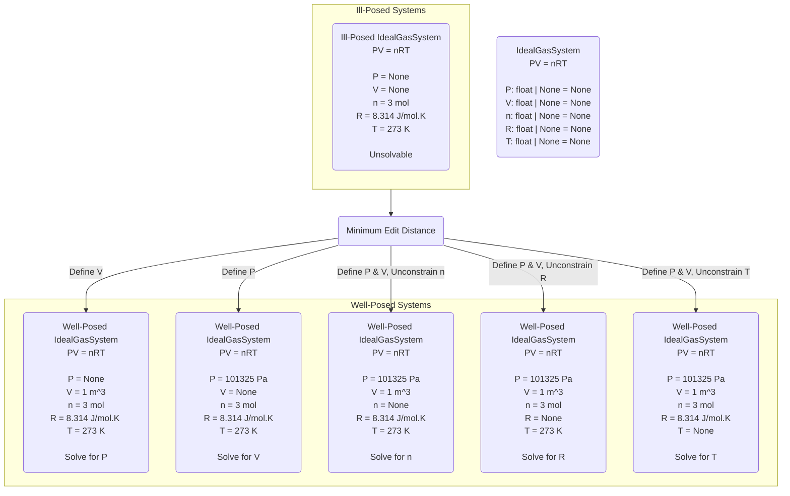

{: .box-success}
This article explores how a classic dynamic programming problem - minimum edit distance - can be repurposed to help engineers navigate system constraints. Using the ideal gas law as an example, we'll see how algorithms typically used for string manipulation can guide users toward well-posed system states.

* Do not remove this line (it will not be displayed)
{:toc}

## The Hidden Beauty of Algorithms

Competitive programming problems often feel divorced from reality. Engineers joke about never using dynamic programming after job interviews. Yet there's an undeniable elegance to these algorithms - similar to the beauty Grant Sanderson reveals in [linear algebra through 3Blue1Brown.](https://www.youtube.com/playlist?list=PLZHQObOWTQDPD3MizzM2xVFitgF8hE_ab) This beauty becomes more apparent when we find unexpected applications in real engineering problems.

## From String Manipulation to System Design

The minimum edit distance problem asks a deceptively simple question: given two strings, what's the minimum number of operations (insertions, deletions, or substitutions) needed to transform one into the other? For example, transforming "cat" to "bat" requires one substitution, while "cat" to "cats" needs one insertion. While this might seem like a purely academic exercise, the underlying principle - finding the shortest path between two states - has broader applications.

While studying this problem, I realized it could solve a practical challenge in engineering system design that I needed in my role as an engineer. The algorithm finds the minimum operations needed to transform one state into another - exactly what we need when helping users fully define the state of a system.

## Engineering Systems and Constraints

Consider a system governed by the ideal gas law: PV = nRT. System in this case is an abstract concept. If you want, you can think of this system as representing an air compressor. This equation relates:

- Pressure (P)
- Volume (V)
- Number of moles [how much gas in the compressor] (n)
- Gas constant (R)
- Temperature (T)

Any four variables uniquely determine the fifth. A clever engineer can write some code that will allow other engineers to specify the system state by defining any 4 of those variables and automatically solving for the 5th. Sometimes, however, the user may accidentally only specify 3/5 variables, leaving the system ill-posed (unconstrained). 

For instance, if you're designing an air compressor system, you might know the volume of your tank (V), the amount of gas you're adding (n), and the ambient temperature (T). But without specifying pressure (P) or verifying the gas constant (R), you can't determine the system's state. The computer needs to tell you: "To solve this system, you need to either specify the pressure or verify the gas constant."

In this simple example, it's easy to tell how to bring the system to a well-posed state. However, in our complex engineering systems with tens of variables and multiple highly coupled governing equations, it's a little less simple. Having the computer tell you the quickest methods for you to fully define the system takes a lot of effort off of the user and makes them happier, since comprehensive error messages explaining the problem and a potential fix are the easiest way to get a user to love your software.

## Visualizing System States

The following diagram illustrates how our system can exist in different states. At the center, we have our base IdealGasSystem class, which can be in either a well-posed state (where we can solve for one variable) or an ill-posed state (where we need more information). The minimum edit distance algorithm helps us find the shortest path from an ill-posed state to any well-posed state.

## Guiding Users with Edit Distance

The minimum edit distance algorithm can help users reach a well-posed system state through minimal changes. Given our ill-posed example with only n, R, and T specified, the algorithm identifies the shortest paths to reach a solvable state:

1. Define V to solve for P
2. Define P to solve for V
3. Define both P and V, then unconstrain one of {n, R, T} to solve for it

This transforms a classic string manipulation algorithm into a practical tool for guiding engineering decisions.

## Runtime Analysis: The Magic of Dynamic Programming

Here is where the beauty of dynamic programming algorithms enters the scene. Consider what happens when we try to find all possible ways to make a system well-posed using a naive recursive approach. Starting with our ill-posed system with three variables specified (n, R, T), at each step we could:

1. Define a new variable
2. Unconstrain an existing variable
3. Both define and unconstrain variables

Consider just three variables (P, V, n) and two operations (define, unconstrain). From a state where only P is defined, we could:

- Define V (leading to state {P,V})
- Define n (leading to state {P,n})
- Unconstrain P (leading to state {})

Each of these new states then has its own branching possibilities, creating an exponentially growing tree of possibilities.

For a system with 5 variables, this creates a tree of possibilities that grows exponentially. Each decision leads to multiple new states, and we need to explore every branch to find the shortest path. If we let m be the number of possible operations we can perform on each variable, and n be the number of variables, the recursive solution would have a runtime of O(m^n) - exponential growth that quickly becomes impractical.

Let's make this concrete with our ideal gas example. At each state, we have roughly 3 choices per variable (define it, unconstrain it, or leave it), and 5 variables total. This means we might need to explore 3^5 = 243 different possible paths to find the optimal solution! And this is just for a simple equation - imagine more complex systems with dozens of variables.

Dynamic programming transforms this exponential nightmare into a tractable polynomial-time solution. The key insight is that we can avoid recalculating the same subproblems repeatedly. Instead of exploring every possible path independently, we:

1. Break down the problem into smaller subproblems
2. Store the results of these subproblems in a table
3. Build up to larger solutions using our previously calculated results

For the minimum edit distance algorithm, this reduces our runtime to O(n × m), where n is the number of variables and m is the number of possible operations we can perform on each variable. In our ideal gas system, that means roughly 5 × 3 = 15 operations - dramatically better than 243!

This is why dynamic programming feels magical - it can turn seemingly impossible problems into efficiently solvable ones by cleverly reusing work we've already done. Just as calculus transforms impossible-looking integrals into routine calculations by breaking them down systematically, dynamic programming transforms exponential problems into polynomial ones through strategic decomposition and memoization.

{: .box-note}
**Visualization**: Imagine having to climb a tree to find the shortest path to any leaf. The recursive solution climbs every possible branch independently. Dynamic programming is like taking a photo of each level as you climb, so you never have to re-climb branches you've already explored.

## Future Applications

While we've demonstrated this approach with the ideal gas law, the same principle could apply to more complex engineering systems like:

- Heat exchanger networks with multiple coupled energy balance equations
- Chemical reactor systems with interconnected mass and energy balances
- Electrical circuit networks with Kirchhoff's voltage and current laws

These systems often have dozens of variables and equations, making it even more critical to have intelligent guidance when trying to reach a well-posed state. The minimum edit distance algorithm, combined with domain-specific knowledge about valid system states, can provide this guidance efficiently.
