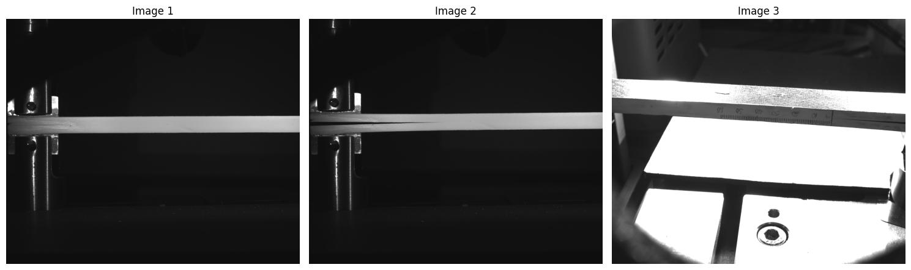
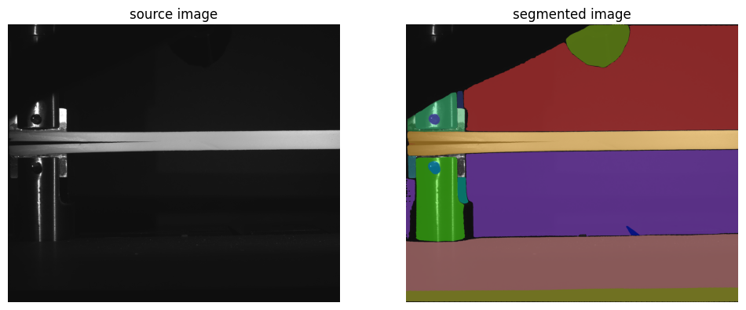
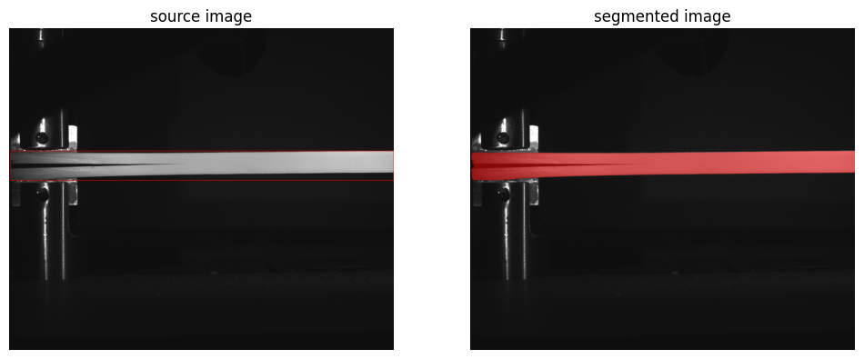
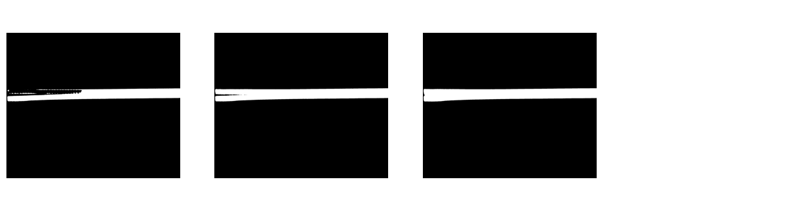
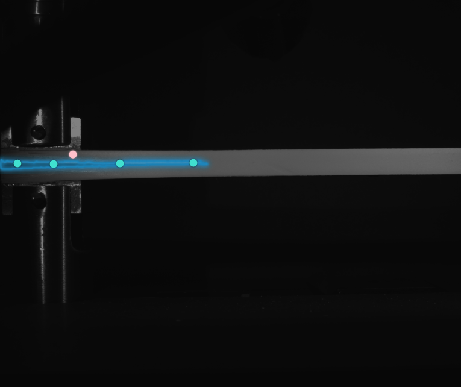
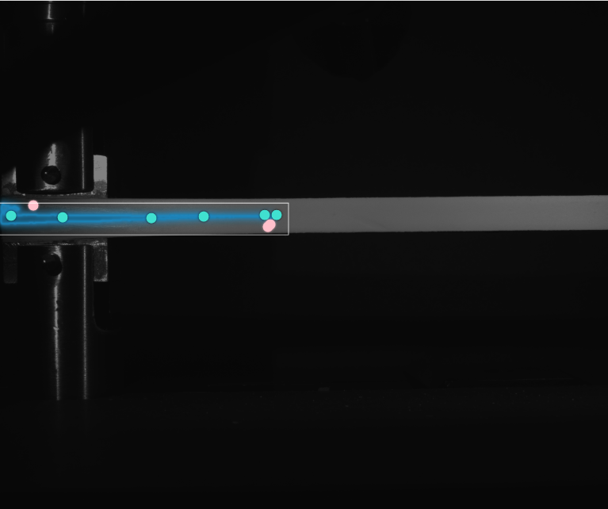
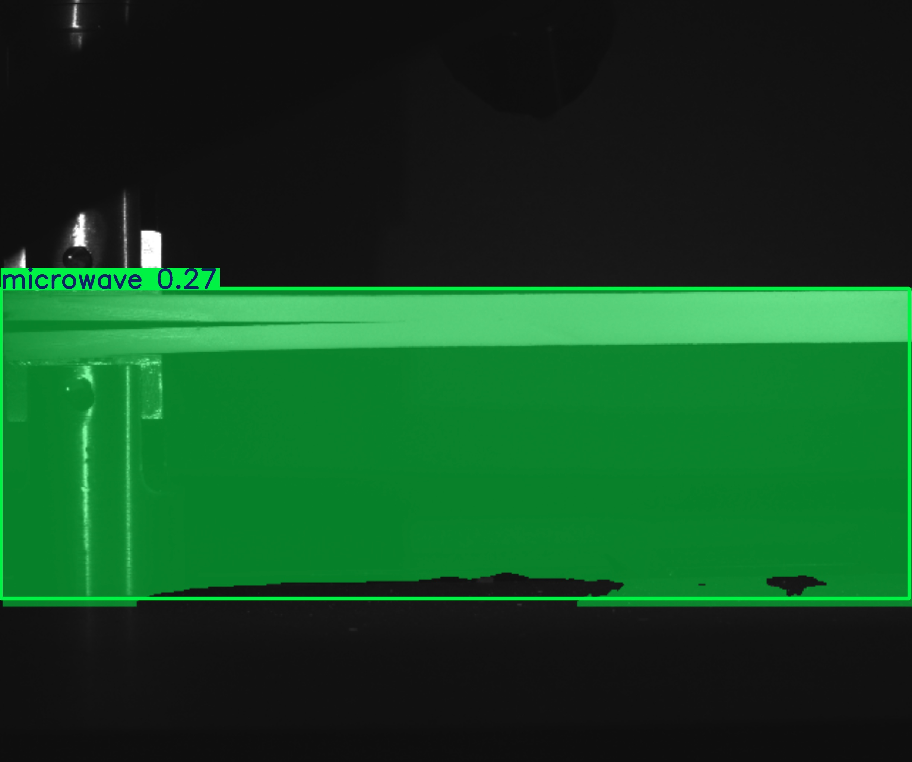
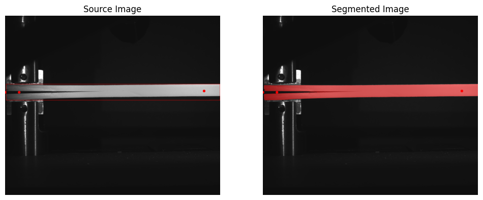

# Crack Image Recognition

## 11/30/2024

### Research

#### SAM

Decided to use the Segment Anything Model since it was listed as SOTA. Used Google CoLab because my laptop was weak and didn't have a GPU, and I was having trouble installing pytorch and didn't want to deal with it. Found a [CoLab Tutorial](https://colab.research.google.com/github/roboflow-ai/notebooks/blob/main/notebooks/how-to-segment-anything-with-sam.ipynb#scrollTo=WYyhnP4xFO5_) that goes over an example of how to segment using the model.

Used these 3 images with permission from GE.

Tried to just use the default SAM model with auto mask to see if it would identify the crack.

The Colab example had bounding box prompting built in, so I tested that as well.

It didn't look like it worked too well, but if you look at the individual masks, it gets close, so there is hope.

Tested out the [Segment Anything Demo](https://segment-anything.com/demo#) to see if point prompting would help the model do better.

The model arguably did do better.

Note, that SAM alone wouldn't identify where the crack is. I could possibly utiltize something like [YOLO and SAM together.](https://medium.com/@nandinilreddy/implementing-yolo-and-sam-unveiling-a-dynamic-duo-in-image-analysis-81c228a02f15)

#### YOLOv11

Found an example using [YoloV11](https://github.com/roboflow/notebooks/blob/main/notebooks/train-yolo11-object-detection-on-custom-dataset.ipynb?ref=blog.roboflow.com)

I tested it out and it was woefully unsuccessful at identifying the crack, as seen below.

#### Conclusion for Today

If I want to use YOLO, I'll have to do custom training on the model.

## 12/1/2024

### Research

#### U-Net

I saw that U-Net is a recommended architecture for image segmentation, but it would have to be trained. I could do that with [this tutorial](https://github.com/robinvvinod/unet/)

#### Grounded Dino

<https://github.com/IDEA-Research/Grounded-Segment-Anything?tab=readme-ov-file>

#### Semantic SAM

<https://github.com/UX-Decoder/Semantic-SAM>

### SAM Decision

Looking at the examples [here](https://github.com/facebookresearch/segment-anything/blob/main/notebooks/predictor_example.ipynb) it is definitely possible to prompt SAM to try to detect just the crack, but that runs into the problem of how to create the prompt in the first place. I could use [DigitalSreeni's Annotation Tool](https://www.youtube.com/watch?v=VI6V95eUUpY) to manually annotate the images and then train U-Net on them, which would be cool. However, that requires manual effort annotating the 1000+ images in the dataset. Instead, I think I'll try to use a recursive detection methodology using SAM where I first detect the sample, then put a bounding box around it and re-run SAM on that bounding box, continuing until I can isolate the crack.

### Conclusion for Today

I prompted SAM in my Google CoLab notebook to try to detect the crack in the image. It was starting to work, and I see potential for an automated detecton system using SAM that might work, it might just be slow to run (especially on 1000+ images).

The current plan is to try to use SAM's auto segment to detect the initial sample, then add a bounding box around the sample, get SAM to focus in on that, detect again, then tell SAM to ignore the crack and negate the sample mask to get the crack.

